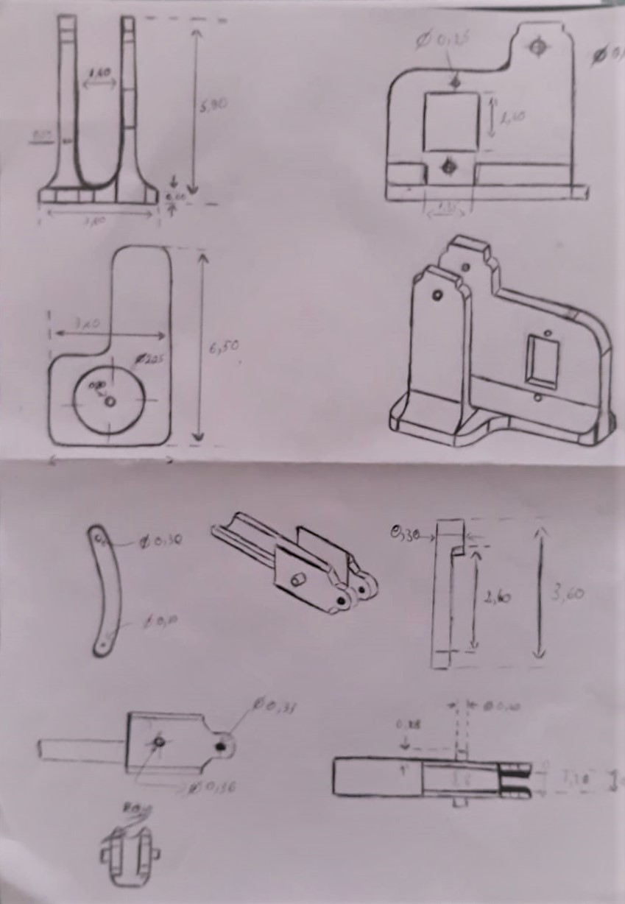
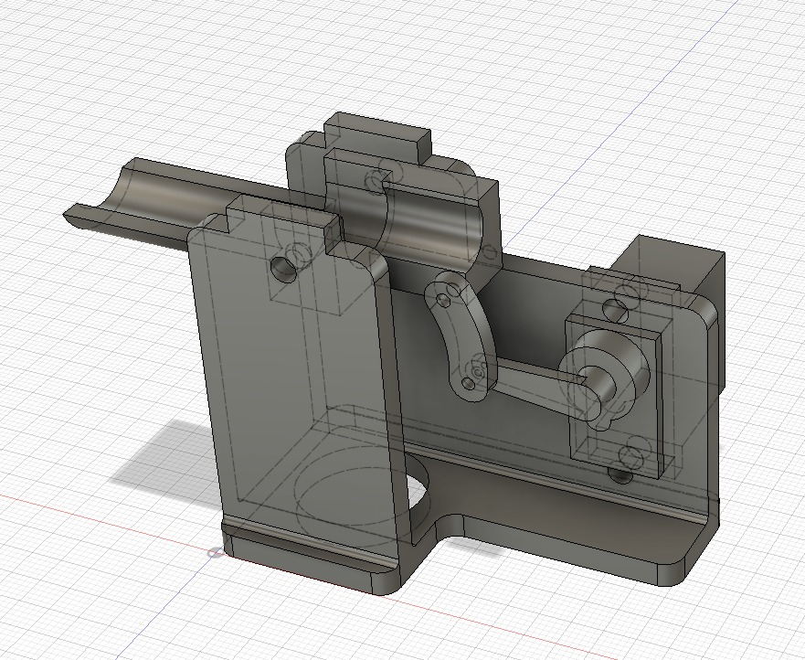
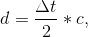

# Autonomous Firefighter Robot
&nbsp; Final project for the Introduction to Robotics Course held by the Robotics Department at the Faculty of Mathematics and Computer Science,
University of Bucharest.

## Table of contents
* [About the project](#about-the-project)
* [Features](#features)
* [Hardware Specifications and 3D printing models](#hardware-specifications-and-3d-printing-models)
* [Tehnical information](#tehnical-information)

## About the project
&nbsp; &nbsp; &nbsp; In the United States, a country which has one of the higher fire death rates, are estimated 1.318.500 fires in 2018. These fires resulted in 3.655 civilian fire fatalities, 15.200 civilian fire injuries and an estimated $25.6 billion in direct property(including $12.4 billion in losses from major California wildfires) according to the United States Fire Departments.  

&nbsp; &nbsp; &nbsp; In an event of a fire breakout, fire spreads rapidly if is not controlled and, in case of a gas leakage there even may be an explosion, so firefighters are constantly at a risk of losing their life. In order to overcome this issue, save the life of our heros, our autonomous firefighter robot comes to rescue. 

### Features:
&nbsp; Autonomous firefighter robot, which is able to avoide obstacle and instantly, flame detection which will enable the emergency mode(self-drive until he arives in fron of the flame). After the vehicle is at athe right position it will start the water pump mechanism which consit from a mini-water pump, a 5V relay module with Status Led, diode and transistor, one servo and one microservo( the servos control the movement of the pump).

##### Presentation video: https://www.youtube.com/watch?v=FE0DiZv4Mc4&feature=youtu.be

### Hardware Specifications and 3D printing models

#### Components:
* Arduino Mega 2560 microcontroller 
* Wires
* 4 X Wheel
* 4 x Ultrasonic Distance Sensor - HC-SR04
* 4 x DC Motor
* Servo Motor
* Micro Servor
* Water pump 3-6V 
* 2 x Infrared sensor module LM393
* Battery 9V
* 3 x Battery 7,4 V
* MotorDriver Shield 239D
* 5V relay module with Status Led, diode and transistor
* Buzzer
* Switch on|off button

#### 3D Models: [models](https://github.com/danadascalescu00/Robotics/tree/master/Autonomous%20Firefighter%20Robot/3D%20Models)

### Tehnical information
<em>Ultrasonic Distance Sensor - HC-SR04 </em>
 
&ensp; This sensor provides 2cm to 400cm of non-contact measurement functionality with a ranging accuracy that can reach up to 3mm. Each HC-SR04 module includes an ultrasonic transmitter, a receiver and a control circuit. 

**Determine water level from the tank:** We used the ultrasonic distance sensor HC-SR04 which sends the sound waves in the water tank and detects reflection of sound waves that is ECHO. The system measures the time between triggered sound wave and received ECHO, and calculates the distance(d) to the water surface using given formula:  
 &emsp; &emsp; &emsp; &emsp; &emsp; &emsp; &emsp; &emsp; &emsp; &emsp; &emsp; &emsp; &emsp; &emsp; &emsp; &emsp; &emsp; &emsp; &emsp; &emsp; &emsp;   
  &emsp; &emsp; &emsp; &emsp; &emsp;where Δt is the travel distance time and c the speed of sound (distance travel per unit time by a sound wave as it propagates through an elastic medium - at approximatively 20 °C is 343 meters per second). 
 
